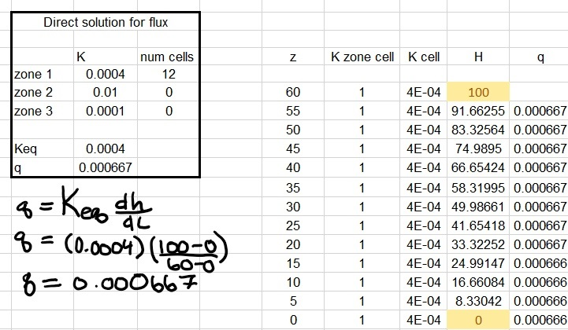

# **The Challenge Answers**
Starlivia Kaska

January 25,2022

**1. Show, based on the flux with depth, that the model is steady state. Repeat this for a homogeneous and for a heterogeneous column.**

 

Figure 1. Homogeneous: K values for all cells were 1 (.004). This shows a steady state model as the flux is constant with depth.

 

Figure 2. Heterogeneous: z(0-30) had K values of 2(0.01) and z(35-60) had K values of 3(.0001). This shows a steady state model as the flux is constant with depth.

**2. Show that the steady state flux agrees with the direct calculation based on the harmonic mean average K. Write the equation defining the direct calculation of the flux.**

For this question I will use values from the homogeneous column in question 1. 

Figure 3. This shows the Keq for the homogeneous column was 0.0004. When you plug .0004 into the flux equation you get 0.000667 which is the same for all of the fluxes for the column. 

The equation for the direct calculation of the flux is q = Q/A = -K(dh/dL)

**3. Show the steady state head profile for a column with appproximately equal-thickness layers that have different K values.** 

.png) .png)

**4. Use the head profile to explain WHY the equivalent Hydraulic conductivity, Keq, is closer to the lower of the two K values.** 

When using the head profile, the explanation seems to be that the equivalent Hydraulic conductivity is closer to the lower of the two K values as the smaller K value has a smaller change in hydraulic head. 

